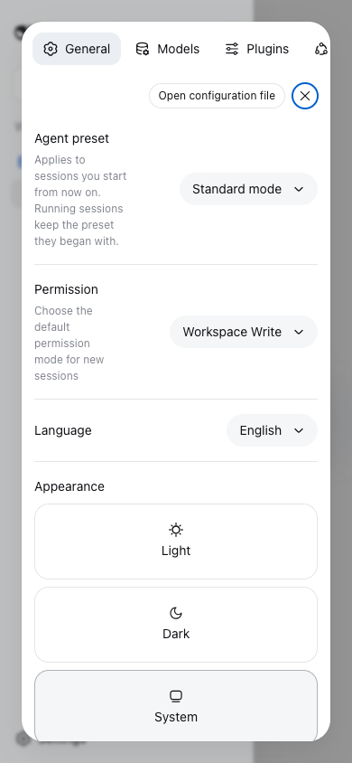
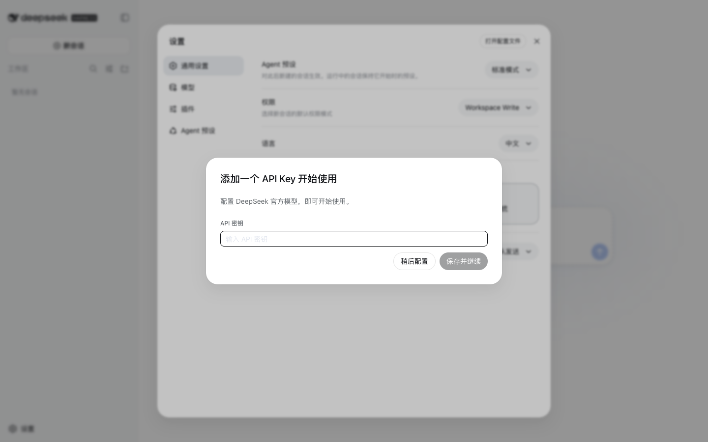

# dsh-mobile

**DeepSeek Harness(DSH)Web 壳层的移动端适配插件。** 原生壳层是桌面优先设计:窄于 1024px 时侧边栏只会自动收起成窄栏;手机上展开抽屉会把主内容区挤到约 110px、composer 按钮互相覆盖、设置弹窗被压成一条缝。`dsh-mobile` 以客户端插件的形式补上缺失的手机档(< 768px)——不改壳层源码,不动桌面端。

[](https://www.npmjs.com/package/@tecfancy/dsh-mobile)
[](LICENSE)

## 功能

- **侧边栏抽屉浮层化** —— 手机上打开侧边栏时,抽屉浮在内容之上并带遮罩,主内容不再被挤到 110px;点击遮罩/外部区域即可关闭。
- **详情面板浮层化** —— 工具详情面板以右侧浮层打开,不再挤压会话主区。
- **composer 底行防重叠** —— 模式按钮与模型选择器自动分行排列,不再互相遮盖。
- **设置弹窗重排** —— 弹窗纵向堆叠,导航变为可横向滚动的标签栏,内容列恢复全宽。
- **桌面零回归** —— 所有规则都挂在窄屏标记之下;≥ 1024px 视口行为与原生壳层完全一致。

## 截图

在 Ubuntu 24.04(x86_64)上、DSH `0.1.0-rc.6`、iPhone 15 视口(390×844)实测截图。

**手机上的新建会话界面**(选中工作区后,hero 与 composer 按窄屏布局排版):


**侧边栏抽屉:修复前(原生壳层)vs 修复后**

| 修复前 —— 主内容被挤到 110px                    | 修复后 —— 浮层抽屉 + 遮罩                     |
| ----------------------------------------------- | --------------------------------------------- |
|  |  |

**手机上的设置弹窗**(纵向布局、内容全宽):



**桌面 ≥ 1024px —— 完全不受影响**:



## 安装

需要 Node ≥ 22 和已安装的 dsh(`dsh` CLI)。装进你的 profile 并重启 `dsh web`:

```bash
dsh plugin --profile web add @tecfancy/dsh-mobile
# 然后重启:dsh web
```

> 提示:如果 npm registry 配置的是镜像(如 `registry.npmmirror.com`),新发布的包可能延迟同步,遇到 404 时加 `--registry=https://registry.npmjs.org/`。

插件会在窄视口(< 768px)自动生效,桌面端保持静默。卸载同样是一条命令:`dsh plugin --profile web remove @tecfancy/dsh-mobile`。

## 工作原理

- JS 断点层把窄视口标记为 `body[data-dsh-mobile]`;
- 状态桥把壳层布局状态映射到 `body[data-dsh-drawer]` / `body[data-dsh-details]`;
- 一套锚定在壳层稳定 `[data-slot]` 钩子上的样式表,在手机档把侧边栏/详情列变成固定浮层、重排 composer 与设置弹窗,并且只在移动档生效。

不改壳层源码、不需要服务器组件,与其他壳层级插件共存(已与 `dsh-better-sidebar` 联调验证)。

## 兼容性

- DSH `0.1.0-rc.6`(macOS 与 Ubuntu 24.04 双环境验证;完整视口矩阵:360 / 390 / 430 / 768 / 1440)。
- 768–1023px 平板区间按设计保持原生壳层行为。
- 遵循 `prefers-reduced-motion`。

## License

MIT
